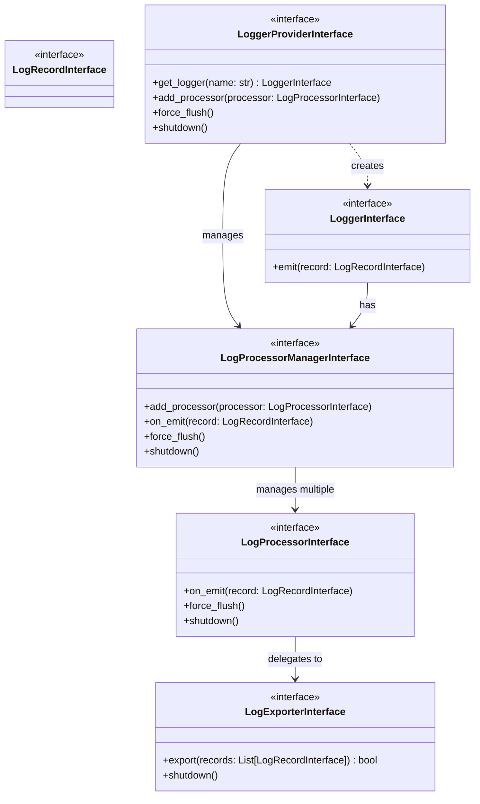

# Interfaces

```mermaid
classDiagram
%% Interfaces
class LogRecordInterface {
  <<interface>>
}
class LoggerInterface {
  <<interface>>
  +emit(record: LogRecordInterface)
}
class LoggerProviderInterface {
  <<interface>>
  +get_logger(name: str) LoggerInterface
  +add_processor(processor: LogProcessorInterface)
  +force_flush()
  +shutdown()
}
class LogProcessorInterface {
  <<interface>>
  +on_emit(record: LogRecordInterface)
  +force_flush()
  +shutdown()
}
class LogProcessorManagerInterface {
  <<interface>>
  +add_processor(processor: LogProcessorInterface)
  +on_emit(record: LogRecordInterface)
  +force_flush()
  +shutdown()
}
class LogExporterInterface {
  <<interface>>
  +export(records: List[LogRecordInterface]) bool
  +shutdown()
}

%% Relationships
LoggerProviderInterface ..> LoggerInterface : creates
LoggerProviderInterface --> LogProcessorManagerInterface : manages
LoggerInterface --> LogProcessorManagerInterface : has
LogProcessorManagerInterface --> LogProcessorInterface : manages multiple
LogProcessorInterface --> LogExporterInterface : delegates to
```
